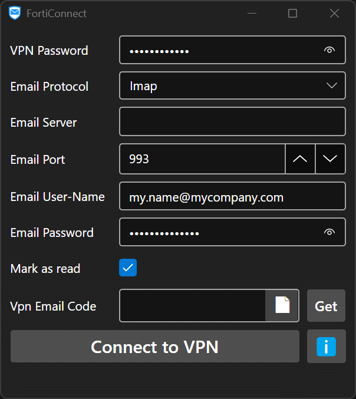

#  FortiConnect

## Description

This app automates the process of connecting to the Fortinet Client VPN when using email as a 2FA (2 Factor Authentication).  

It gets the VPN code from your recent emails automatically and can also write the credentials 
and email code in the FortiClient VPN application.  

## Documentation

- [User's Guide](/docs/UserGuide.md)
- [Developer's Guide](/docs/DevelopersGuide.md)

  

