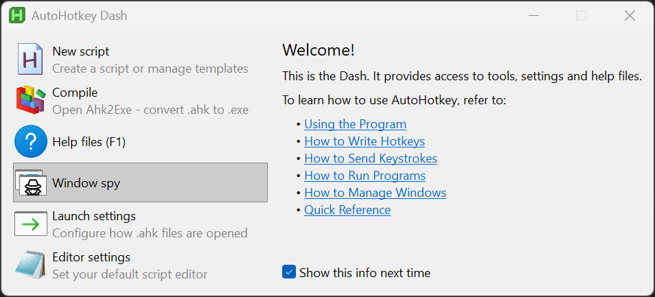
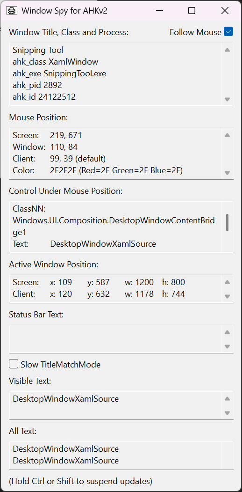
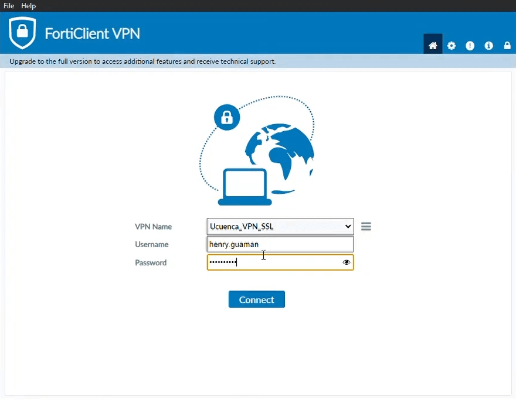
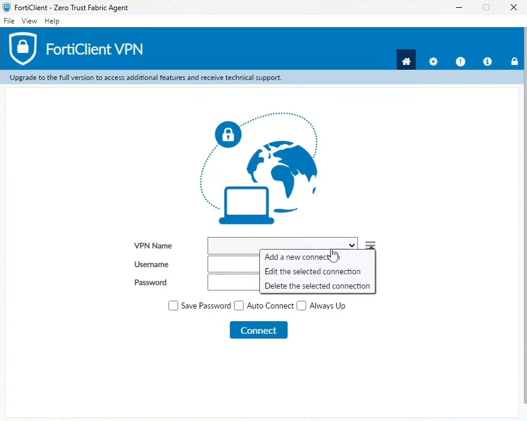
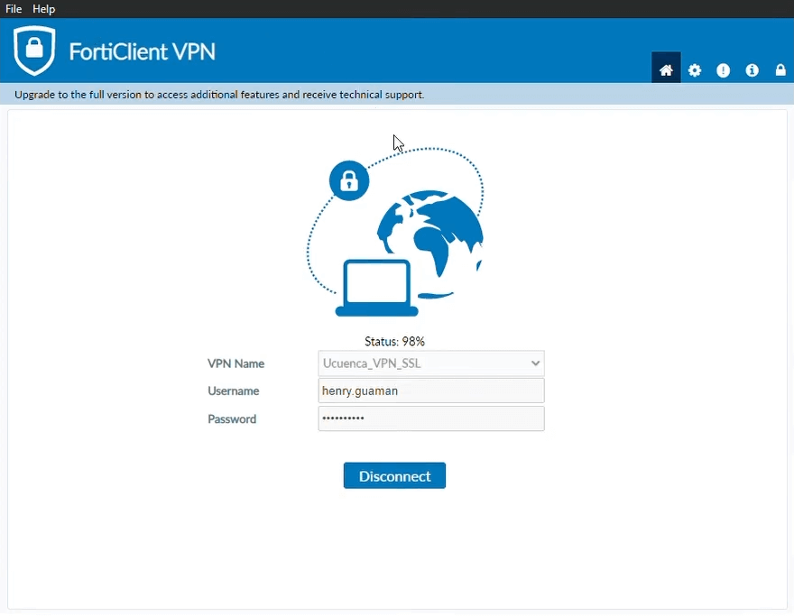
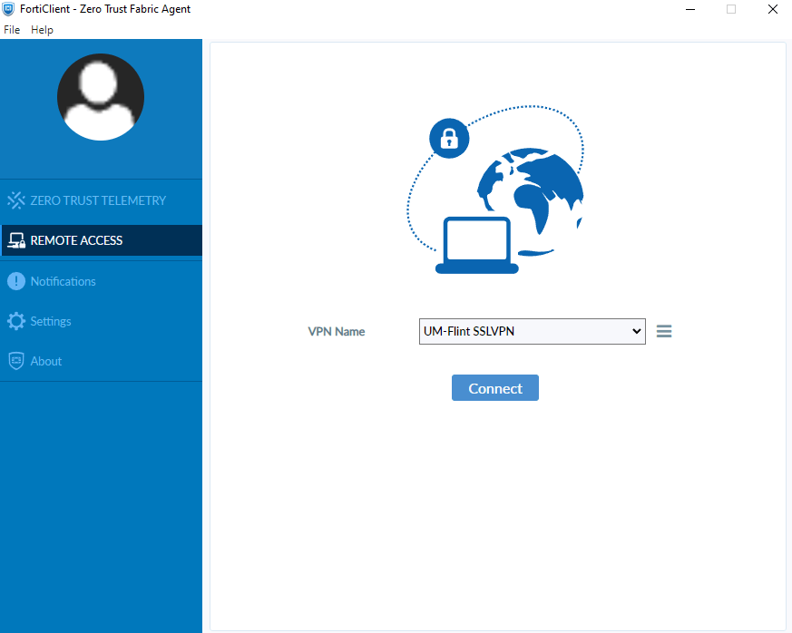

# Developer's Guide

## Developer Software
- Visual Studio 2026 (or higher)
- Windows (on Mac or Linux it may work except for the FortiClient UI automation part that uses Windos APIs to send keys)
- DotNet 10.0 SDK ([url](https://dotnet.microsoft.com/download))

## Dependencies
- [(Avalonia-UI)](https://avaloniaui.net): Cross platform UI.
- Windows API: to automate the FortiClient UI keystrokes.

## How to debug
Create a file named `AppSettings.local.json` with your personal information, next to the `AppSettings.json`  
to prevent your credentials from ending up in the git repository. 
This file is excluded from git in `.gitignore`, and can override the configuration from `AppSettings.json`.

## Known issues

### Getting he emails takes more than 1 minute using MS Exchange EWS
Some VPN 2FA email may only last for 1 minute, making the automation fail.

### Microsoft Exchange WebService EWS decommission
The official EWS source is in GitHub but has not been updated since 2015 
([GitHub](https://github.com/OfficeDev/ews-managed-api)), 
([docs](https://docs.microsoft.com/en-us/exchange/client-developer/exchange-server-development)).  
There are [community supported versions of EWS](https://github.com/sherlock1982/ews-managed-api) 
to make it work with dotnet core.  

EWS will be decommissioned in 2020 as a method to access Office 365 (on-premise servers will continue to work). 
[See this](http://techgenix.com/ews-no-updates/ ).  
It will be required to migrate to Microsoft Graph API.  

### Microsoft Graph API
The new way to programatically interact with Office is using [the Graph-API](https://docs.microsoft.com/en-us/graph/overview ). 
- Docs for [Outlook interaction](https://docs.microsoft.com/en-us/graph/api/resources/mail-api-overview?view=graph-rest-1.0 ).
- Api example to get emails: `https://graph.microsoft.com/v1.0/me/messages?$search="hello world"`
- Graph Explorer Utility [url](https://developer.microsoft.com/en-us/graph/graph-explorer ). 
- [PowerShel Microsoft Graph tutorial](https://www.youtube.com/watch?v=6CIZWac0TBE ).

Graph API requires you to grant access to the app from your office account,
that may require you to have admin privileges that your company may didn't give you.

### UI Automatcion Alternatives
All the listed UI automation options only work on Windows,  
Linux and MacOS won't allow any of them due to their app isolation security model.  
https://www.reddit.com/r/csharp/comments/9dyf0t/having_my_program_send_an_enter_key_press/  

#### Windows APIs Win32: SendInput (with SendKeys / VirtualKeyboard):
Uses Win32 API `SendInput`, either via WindowsForm's `SendKey` or a NuGet package.  
Works with any app as it just sends keystrokes.  
Available Input-Simulation libraries:  
- WindowsForms `SendKey`: ([git](https://github.com/dotnet/winforms)) Not recommended because adding a reference to WinForms doesn't allow trimming the assembly.  
- NuGet package "`AutoHotkey.Interop`": ([git](https://github.com/amazing-andrew/AutoHotkey.Interop)) This is overkill for this task.  
- NuGet package "`InputSimulator`": ([git](https://github.com/michaelnoonan/inputsimulator)) Basic.  
- NuGet package "`InputSimulatorPlus`": ([git](https://github.com/TChatzigiannakis/InputSimulatorPlus)) Forked from `InputSimulator` adds scan codes.  
- NuGet package "`InputSimulatorStandard`": ([git](https://github.com/GregsStack/InputSimulatorStandard)) Forked from `InputSimulatorPlus` converted to dotnet standard 2.0.  
- NuGet package "`H.InputSimulator`": ([git](https://github.com/HavenDV/H.InputSimulator)) Based on `InputSimulatorStandard` converted to dotnet standard 2.0 or dotnet 8 for AOT and trimming.  

In order of creation: `InputSimulator < InputSimulatorPlus < InputSimulatorStandard < H.InputSimulator`.  
So the best InputSimulator NuGet package option at the moment is `H.InputSimulator`.  
Having a custom solution is ideal as far as it just works without many issues,  
but if issues arrise, just use `H.InputSimulator` as  an IVirtualKeyboard.  

#### Windows APIs Win32: FindWindow + SendMessage:
Uses Win32 APIs `FindWindow`, `FindWindowEx` and `SendMessage`.  
Works with some apps that expose their controls as  native Windows controls, doesn't work well with WPF, UWP, WinUI.  
This is the same APIs used by [AutoHotKey](https://www.autohotkey.com/) (AHK) in these functions:  
[Control](https://www.autohotkey.com/docs/v2/lib/Control.htm), 
[ControlSetChecked](https://www.autohotkey.com/docs/v2/lib/ControlSetChecked.htm), 
[ControlClick](https://www.autohotkey.com/docs/v2/lib/ControlClick.htm), 
[ControlGetText](https://www.autohotkey.com/docs/v2/lib/ControlGetText.htm), 
[ControlSetText](https://www.autohotkey.com/docs/v2/lib/ControlSetText.htm).  
The AutoHotKey's WindowsSpy tool (within the [AHK dash](https://www.autohotkey.com/docs/v2/Program.htm#dash)) that comes along the AHK installer is used to get the control's class and name used for this automation.  
You can use AHK to test if the app you want to automate supports this type of automation using Win32 APIs.
 
 

#### Windows UI Automation (UIA):
Uses [Windows Automation API](https://learn.microsoft.com/en-us/windows/win32/winauto/windows-automation-api-overview) 
within the `System.Windows.Automation` namespace, which wraps COM services and works natively with dotnet UIs (Win32, WPF, UWP, WinUI).  
It is used by adding references to the DLLs: `UIAutomationClient.dll` and  `UIAutomationTypes.dll`  
found in `C:\Program Files\Reference Assemblies\Microsoft\Framework\v3.0\`.  
It was introduced in 2006 along with Windows Vista and .net framework 3.0,  
as a replacement for the `Microsoft Active Accessibility` API (MSAA) from 1995's Windows95.  

#### WinAppDriver / Appium:
It is a WebDriver implementation (like Selenium) built around UIA.  
Originally developed by microsoft as [WinAppDriver](https://github.com/microsoft/WinAppDriver) until dotnet-5,  
and latter on deprecated in favour of the cross-platform [Appium-windows-driver](https://github.com/appium/appium-windows-driver) from [Appium](https://appium.io/).  
It requires installing the driver in the computer that runs the automation, so it its not ideal for some automation tools.  

#### FlaUI:
Uses UIA internally, wrapping it, and is the evolution of the old and deprecated [TestStack.White](https://github.com/TestStack/White) ([NuGet](https://www.nuget.org/packages/TestStack.White)).  
It comes as a NuGet package: [FlaUI.UIA3](https://www.nuget.org/packages/FlaUI.UIA3) ([git](https://github.com/FlaUI/FlaUI)).  
This is the most recommended option for serious UI automation.  

### FortiClient UI
The following is a reference of the FortiClient UI that this project automates.  
It may change in future updates from Fortinet.  

FortiClientVPN Login:  
  
FortiClientVPN Login Options:  
  
FortiClientVPN Connecting:  
  
FortiClientVPN Connected:  
  

ZeroTrustFabricAgent Client:  
This client is another app from Fortinet to connect to their VPN,  
but this app is NOT supported by FortiConnect,  
so make sure you have toe correct FortiClient installed:  
  

